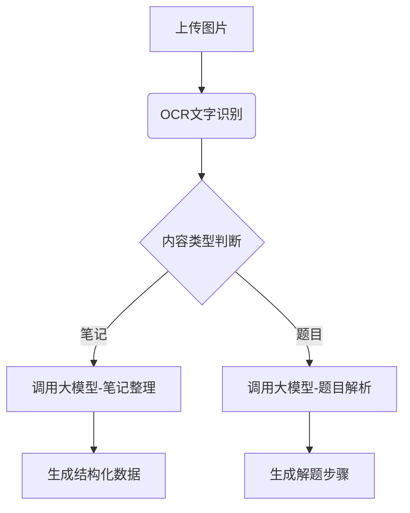

# 技术方案文档

## 一、技术架构设计
### 1. 整体架构
采用前后端分离架构：
```
[客户端] -> [Nginx反向代理] -> [前端服务] 
            | 
            -> [后端API服务] <-> [MySQL数据库]
                              <-> [对象存储服务]
                              <-> [vivo蓝心大模型API]
```

### 2. 技术栈选型
| 层级        | 技术方案                          |
|-------------|----------------------------------|
| 前端        | React 18 + Ant Design + Axios    |
| 后端框架    | FastAPI   |
| 数据库      | MySQL 8.0       |
| 存储服务    | 阿里云OSS  |
| AI集成      | vivo蓝心大模型API                |

## 二、核心模块技术实现
### 1. 图片处理模块
- **前端实现**：
  - 使用`react-dropzone`实现拖拽上传
  - 图片压缩：`browser-image-compression`
  - 上传进度显示：Axios onUploadProgress

- **后端实现**：
  ```python
  @app.post("/upload/")
  async def upload_image(file: UploadFile = File(...)):
      # 文件格式验证（PNG/JPG）
      # 病毒扫描
      # 存储到OSS并生成访问URL
      return {"url": oss_url, "file_id": file_id}
  ```

### 2. AI处理模块


### 3. 思维导图生成
- **技术方案**：
  - 前端使用`react-flow`实现可视化
  - 后端通过大模型生成MindMap数据结构：
  ```json
  {
    "nodes": [
      { "id": "1", "data": { "label": "核心概念" }},
      { "id": "2", "data": { "label": "子主题1" }}
    ],
    "edges": [{ "id": "e1-2", "source": "1", "target": "2" }]
  }
  ```

### 4. 数据库设计
#### 主要数据表：
```sql
-- 图片处理记录表
CREATE TABLE process_records (
    record_id VARCHAR(36) PRIMARY KEY,
    user_id INT,
    original_url VARCHAR(255),
    processed_data JSON,
    status ENUM('pending', 'processing', 'completed', 'failed'),
    created_at TIMESTAMP DEFAULT CURRENT_TIMESTAMP
);

-- 题目讲解表
CREATE TABLE explanations (
    question_id VARCHAR(36) PRIMARY KEY,
    stem TEXT,
    solution_steps JSON,
    video_url VARCHAR(255),
    difficulty_level TINYINT
);
```

## 三、关键接口设计
| 接口类型   | 路径                   | 说明                          |
|------------|------------------------|-----------------------------|
| POST       | /api/v1/upload         | 图片上传接口                 |
| POST       | /api/v1/process/notes  | 笔记处理请求                 |
| GET        | /api/v1/status/{id}    | 处理状态查询                 |
| POST       | /api/v1/generate/mindmap | 思维导图生成接口            |

## 四、性能优化方案
1. **缓存策略**：
   - Redis缓存高频题目解析结果
   - 客户端本地缓存思维导图数据

2. **异步处理**：
   ```python
   # 使用Celery处理耗时任务
   @celery.task
   def async_process_image(file_id):
       # 调用大模型API
       # 更新处理状态
       update_record_status(file_id, 'completed')
   ```

3. **大模型调用优化**：
   - 请求批处理
   - 超时重试机制
   - 结果缓存

## 五、安全设计
1. 图片内容安全审查
2. JWT身份验证
3. 文件上传限制：
   - 单文件≤10MB
   - 每日上传限额
4. SQL注入防护（SQLAlchemy自动参数化查询）

## 六、运维方案
1. **监控体系**：
   - Prometheus + Grafana监控API性能
   - Sentry错误日志收集

2. **灰度发布**：
   - 通过Nginx进行流量切分
   - AB测试新算法版本

3. **灾备方案**：
   - 数据库主从复制
   - OSS跨区域备份

