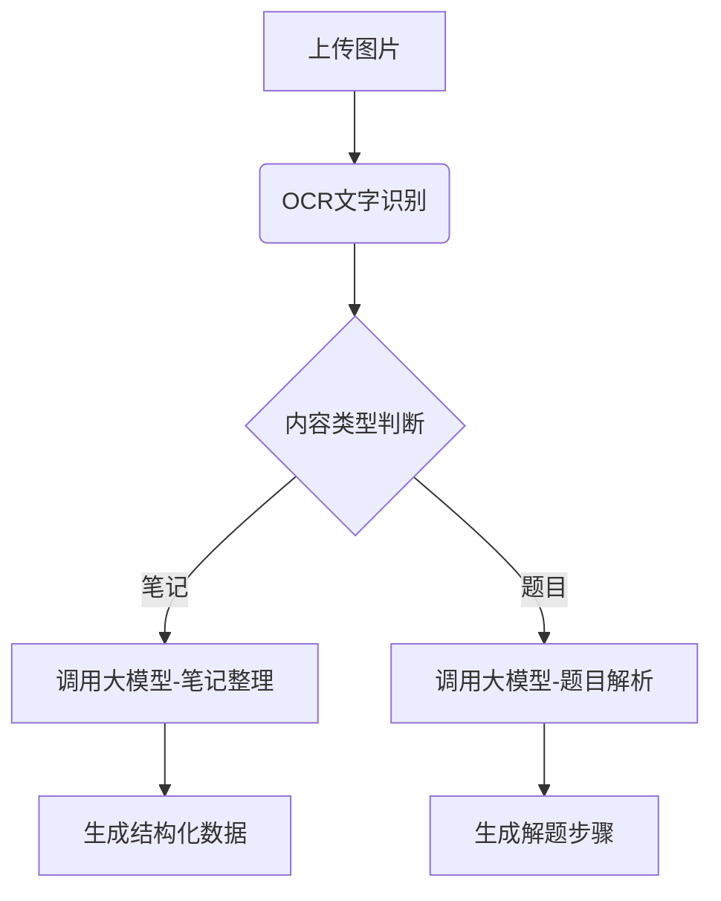

# 技术方案文档

## 一、技术架构设计
### 1. 整体架构
采用前后端分离架构：
```
[客户端] -> [Nginx反向代理] -> [前端服务] 
            | 
            -> [后端API服务] <-> [MySQL数据库]
                              <-> [对象存储服务]
                              <-> [vivo蓝心大模型API]
```

### 2. 技术栈选型
| 层级        | 技术方案                          |
|-------------|----------------------------------|
| 前端        | React 18 + Ant Design + Axios    |
| 后端框架    | FastAPI   |
| 数据库      | MySQL 8.0       |
| 存储服务    | 阿里云OSS  |
| AI集成      | vivo蓝心大模型API                |

## 二、核心模块技术实现
### 1. 图片处理模块
- **前端实现**：
  - 使用`react-dropzone`实现拖拽上传
  - 图片压缩：`browser-image-compression`
  - 上传进度显示：Axios onUploadProgress

- **后端实现**：
  ```python
  @app.post("/upload/")
  async def upload_image(file: UploadFile = File(...)):
      # 文件格式验证（PNG/JPG）
      # 病毒扫描
      # 存储到OSS并生成访问URL
      return {"url": oss_url, "file_id": file_id}
  ```

### 2. AI处理模块


### 3. 思维导图生成
- **技术方案**：
  - 前端使用`react-flow`实现可视化
  - 后端通过大模型生成MindMap数据结构：
  ```json
  {
    "nodes": [
      { "id": "1", "data": { "label": "核心概念" }},
      { "id": "2", "data": { "label": "子主题1" }}
    ],
    "edges": [{ "id": "e1-2", "source": "1", "target": "2" }]
  }
  ```

### 4. 数据库设计
#### 主要数据表：
```sql
-- 图片处理记录表
CREATE TABLE process_records (
    record_id VARCHAR(36) PRIMARY KEY,
    user_id INT,
    original_url VARCHAR(255),
    processed_data JSON,
    status ENUM('pending', 'processing', 'completed', 'failed'),
    created_at TIMESTAMP DEFAULT CURRENT_TIMESTAMP
);

-- 题目讲解表
CREATE TABLE explanations (
    question_id VARCHAR(36) PRIMARY KEY,
    stem TEXT,
    solution_steps JSON,
    video_url VARCHAR(255),
    difficulty_level TINYINT
);
```

## 三、关键接口设计
| 接口类型 | 路径                          | 说明              |
|------|-----------------------------|-----------------|
| POST | /api/notes/extract          | 上传图片，返回处理结果     |
| POST | /api/notes/mindmap          | 上传图片，返回思维导图所需要的格式 |
| POST | /api/notes/keywords         | 上传摘要内容（文字），返回关键词 |
| POST | /api/notes/record           | 上传笔记内容，返回存储结果   |
| POST | /api/notes/explanation      | 上传笔记内容，返回讲解     |

### 前端请求接口

### 后端响应接口
interface BaseResponse<T> {
  code: number;      // 状态码 (200=成功)
  message: string;   // 提示信息 ("success" 或错误描述)
  data: T;           // 业务数据
  timestamp: number; // 服务器时间戳
}
- /api/notes/extract 返回摘要结果
前端请求：
```typescript
interface ExtractImageParams {
  image: File;
  enhanceMode?: 'text' | 'table';
}
```
后端响应
```json
{
  "code": 200,
  "message": "success",
  "data": {
    "extract_id": "ex_001",
    "text_content": "",
    "expend": ""  
  },
  "timestamp": 1719900000
}

```
- /api/notes/mindmap 思维导图
前端请求
```typescript
interface MindmapParams {
  image: File;
  style?: 'radial' | 'tree';
}
```
后端响应
```json
{
  "code": 200,
  "message": "success",
  "data": {
    "mindmap_id": "mm_2023",
    "layout_type": "radial",
    "root_node": {
      "id": "n0",
      "label": "机器学习",
      "children": [
        {
          "id": "n1",
          "label": "监督学习",
          "color": "#FF6B6B",
          "children": [
            {"id": "n1-1", "label": "分类", "link": "/notes/123"}
          ]
        }
      ]
    },
    "svg_url": ""
  },
  "timestamp": 1719900000
}

```
-  /api/notes/keywords 提取关键词
前端请求
```typescript
interface KeywordsParams {
  text: string;
  maxKeywords?: number;
  algorithm?: 'tfidf' | 'textrank';
}
```
```json
{
  "code": 200,
  "message": "success",
  "data": {
    "keywords": [
      {
        "term": "梯度下降",
        "tfidf_score": 0.92,
        "related_notes": ["note_001", "note_005"],
      },
      {
        "term": "过拟合",
        "tfidf_score": 0.85,
        "related_questions": ["q_2023"]
      }
    ]
  },
  "timestamp": 1719900000
}

```
- /api/notes/record 保存笔记，返回保存结果
前端请求
```typescript
interface RecordNoteParams {
    title: string;
    content: string;
    tags?: string[];
    mindmapId?: string;
}
```
后端响应
```json
{
  "code": 200,
  "message": "success",
  "data": {
    "note_id": "note_20230801",
    "content": "success | fail"
  },
  "timestamp": 1719900000
}

```
- /api/notes/explanation 生成讲解，返回MarkDown格式
前端请求
```typescript
interface ExplanationParams {
  content: string;
  difficulty?: 'beginner' | 'intermediate' | 'advanced';
}
```
后端响应
```json
{
  "code": 200,
  "message": "success",
  "data": {
    "explanation_id": "exp_789",
    "content_md": "## 什么是梯度下降?\n\n就像下山时寻找最快路径...",
  },
  "timestamp": 1719900000
}

```

## 四、性能优化方案
1. **缓存策略**：
   - Redis缓存高频题目解析结果
   - 客户端本地缓存思维导图数据

2. **异步处理**：
   ```python
   # 使用Celery处理耗时任务
   @celery.task
   def async_process_image(file_id):
       # 调用大模型API
       # 更新处理状态
       update_record_status(file_id, 'completed')
   ```

3. **大模型调用优化**：
   - 请求批处理
   - 超时重试机制
   - 结果缓存

## 五、安全设计
1. 图片内容安全审查
2. JWT身份验证
3. 文件上传限制：
   - 单文件≤10MB
   - 每日上传限额
4. SQL注入防护（SQLAlchemy自动参数化查询）

## 六、运维方案
1. **监控体系**：
   - Prometheus + Grafana监控API性能
   - Sentry错误日志收集

2. **灰度发布**：
   - 通过Nginx进行流量切分
   - AB测试新算法版本

3. **灾备方案**：
   - 数据库主从复制
   - OSS跨区域备份

